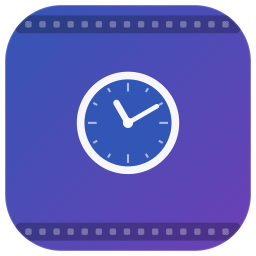

<div align="center">

# 🎬 Footage Calculator



**Scan a folder and instantly total your video footage duration.**


[Features](#-features) · [Getting Started](#-getting-started) · [How It Works](#-how-it-works) · [File Categories](#-file-categories) · [License](#-license)

</div>

---

## ✨ Features

- **Instant Duration Totals** — Drop any folder and get the total runtime of all video and audio files
- **Drag & Drop** — Drop folders or files directly onto the window, or use the Browse button
- **Recursive Scanning** — Toggle subfolder scanning to total an entire project or just one directory
- **Multi-Format Support** — Recognizes 20+ video formats including .mp4, .mov, .mkv, .r3d, .braw, .mxf, and more
- **Total Duration at a Glance** — A big running total across all video + audio, plus per-category breakdowns
- **Category Breakdown** — Color-coded cards for Video, Audio, Images, and Other files with counts and durations
- **Copy & Export** — Copy the summary to the clipboard or save it as a `.txt` file
- **No External Dependencies** — Uses AVFoundation for duration detection (no ffprobe/FFmpeg required)
- **Sandboxed & Native** — App Sandbox enabled with read-only access to user-selected files; built with SwiftUI
- **Async Scanning** — Swift concurrency keeps the UI responsive with live progress updates

---

## 🚀 Getting Started

### Prerequisites

- macOS 14.0 (Sonoma) or later
- Xcode 15+

### Running

```bash
git clone https://github.com/markksantos/FootageCalculator.git
cd FootageCalculator
open FootageCalculator.xcodeproj
```

Then hit **Run** in Xcode, or build from the command line:

```bash
xcodebuild -project FootageCalculator.xcodeproj -scheme FootageCalculator build
```

### Tests

```bash
xcodebuild -project FootageCalculator.xcodeproj -scheme FootageCalculator \
  -destination 'platform=macOS' test
```

The `FootageCalculatorTests` target covers file classification, duration
formatting, file collection (recursive / non-recursive), and the export
summary. CI runs the same suite on every push via
[`.github/workflows/ci.yml`](.github/workflows/ci.yml).

### Legacy Python Version

The original Python/tkinter version is still available (requires Python 3.9+ and FFmpeg):

```bash
python3 footage_calculator.py
```

---

## 🏗️ How It Works

1. **Drop** a folder or files onto the window (or click Browse)
2. The app walks the directory and classifies every file by extension
3. **AVFoundation** extracts the duration of each video and audio file natively
4. **Results** are displayed as category cards with formatted totals (MM:SS or HH:MM:SS)

Files that AVFoundation can't read are counted but marked with unknown duration.

---

## 📂 File Categories

| Category | Extensions |
|----------|-----------|
| Video | .mp4, .mov, .avi, .mkv, .wmv, .flv, .webm, .m4v, .mpg, .mpeg, .3gp, .ts, .mts, .m2ts, .vob, .ogv, .mxf, .r3d, .braw, .prores |
| Audio | .mp3, .wav, .aac, .flac, .ogg, .wma, .m4a, .aiff, .aif, .opus |
| Image | .jpg, .jpeg, .png, .gif, .bmp, .tiff, .tif, .webp, .heic, .heif, .raw, .cr2, .nef, .arw, .psd |
| Other | Everything else (counted, not analyzed) |

---

## 📦 Deploying

The app is sandboxed and hardened-runtime ready. To produce a distributable,
notarized DMG you need an Apple Developer account and a **Developer ID
Application** certificate in your login keychain.

```bash
# Sign + export + DMG (signed, not notarized):
DEVELOPMENT_TEAM=YOURTEAMID ./scripts/build-release.sh

# Same, plus notarize + staple (requires a notarytool keychain profile):
xcrun notarytool store-credentials fc-notary \
  --apple-id "you@example.com" --team-id YOURTEAMID --password "app-specific-pw"
DEVELOPMENT_TEAM=YOURTEAMID NOTARY_PROFILE=fc-notary ./scripts/build-release.sh
```

The output DMG lands in `build/FootageCalculator.dmg`.

For the **Mac App Store** instead of direct distribution, change `method` to
`app-store-connect` in `scripts/ExportOptions.template.plist` and use a Mac App
Store provisioning profile / certificate.

---

## 📄 License

MIT License © 2026 Mark Santos

---

<div align="center">

Built with ❤️ by [NoSleepLab](https://nosleeplab.com)

</div>
